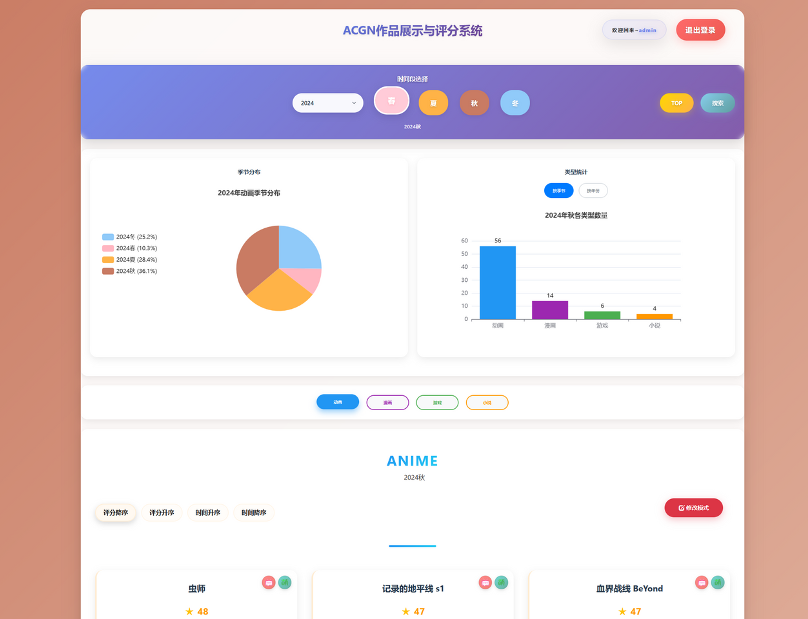
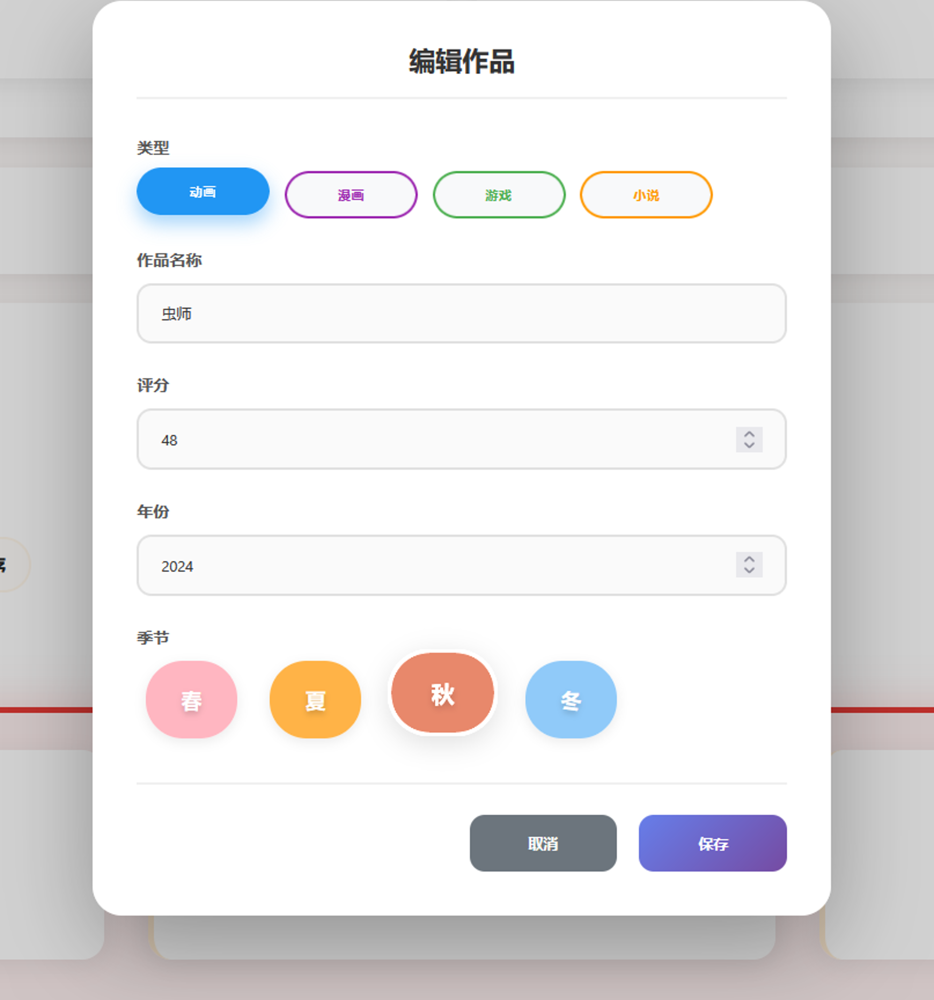
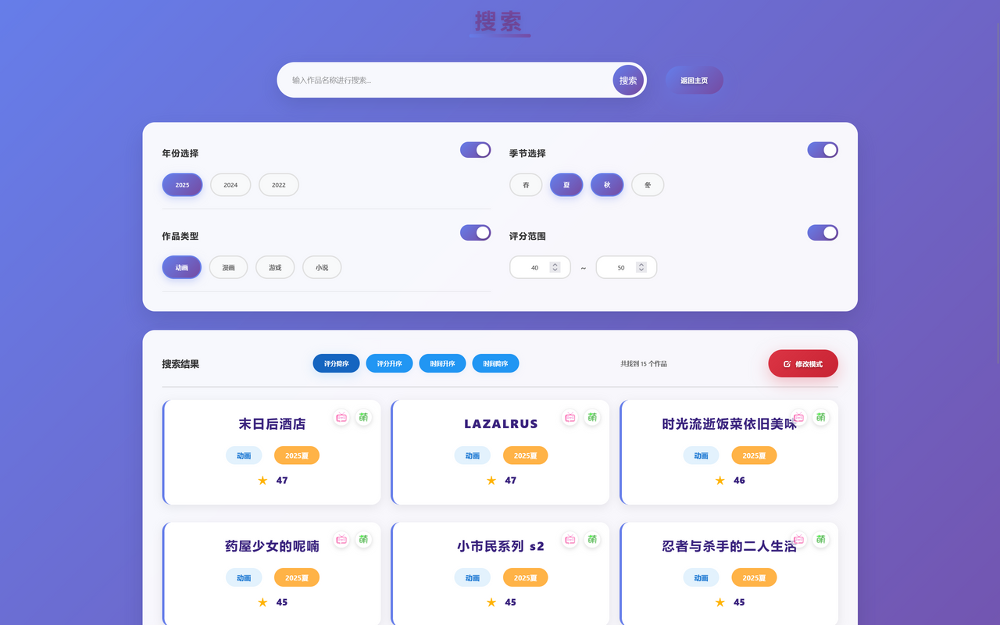
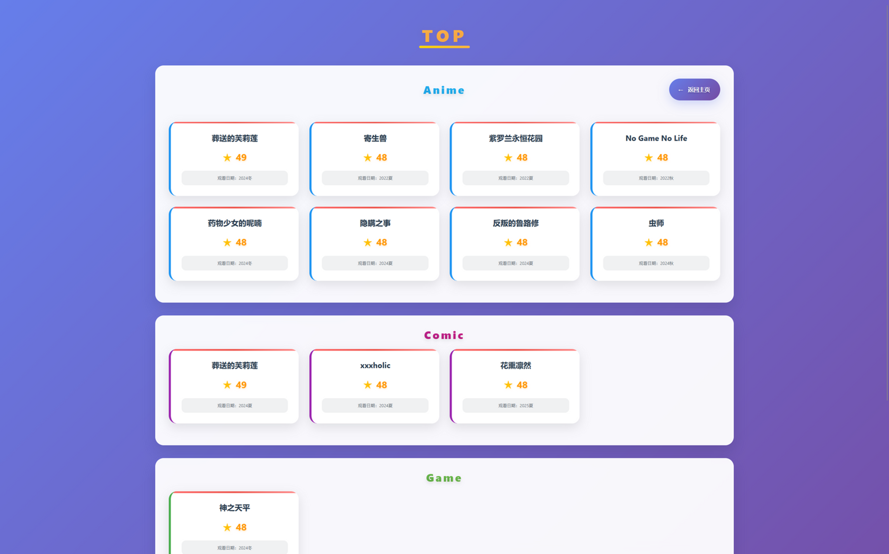
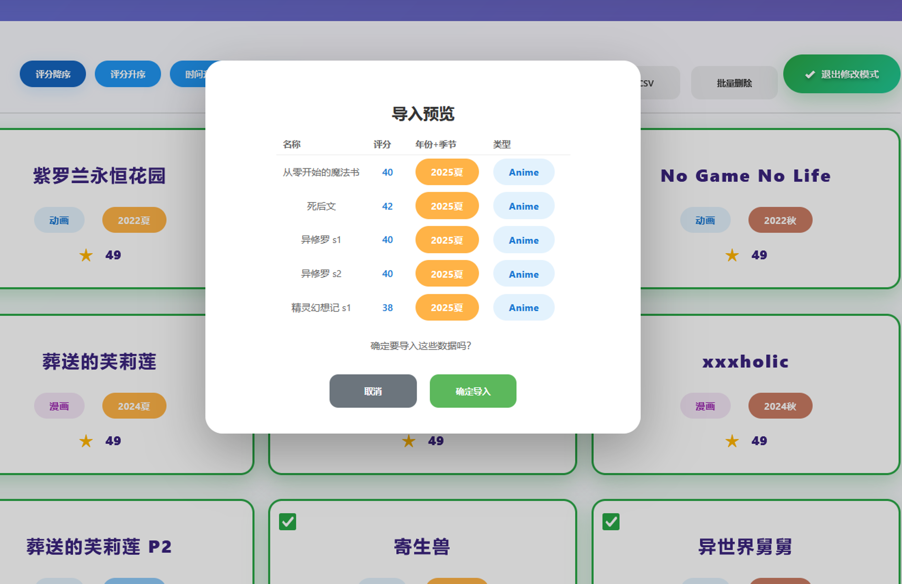
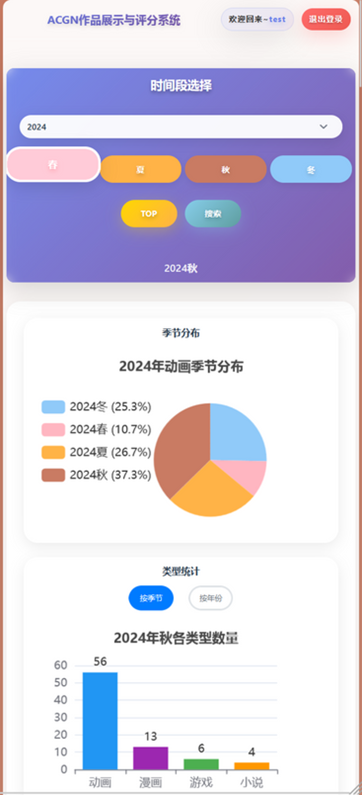
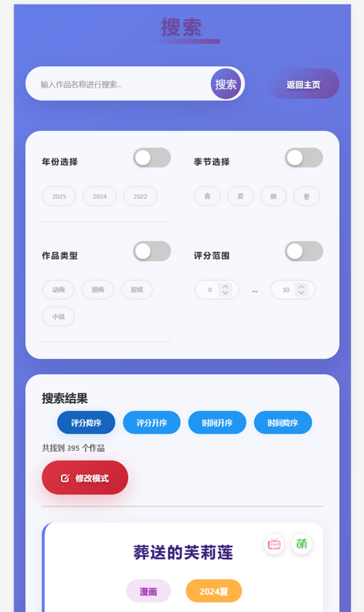

# ACGN作品记录管理系统

这是一个基于 Java Servlet、JDBC、MySQL、jQuery 和 ECharts 的轻量级 ACGN 作品记录管理系统。

项目面向动画、漫画、游戏、小说四类作品的日常记录与管理，强调界面直观、操作直接、功能聚焦。系统支持用户注册登录、作品增删改查、统计图表、TOP 展示、CSV 导入导出以及多条件搜索，适合作为课程项目展示，也适合作为传统 Java Web 项目的练习与整理样例。

## 项目展示

### 登录页


### 主页



### 编辑作品



### 搜索页



### TOP页面



### CSV批量导入



### 手机端主页



### 手机端搜索页



## 功能概览

### 1. 账号功能

- 支持用户注册、登录、退出登录、密码重置
- 支持基于 Session 的登录状态管理
- 已补充统一登录校验，未登录访问受保护页面会跳回登录页，接口会返回未登录提示

### 2. 作品管理

- 支持新增作品、编辑作品、删除作品
- 支持按年份、季节、类型查看对应作品列表
- 支持对作品进行评分记录
- 支持在编辑模式下直接操作作品卡片

### 3. 搜索与筛选

- 支持关键词搜索
- 支持按年份、季节、类型、评分区间进行组合筛选
- 支持搜索结果展示与结果操作

### 4. 数据分析与展示

- 支持按年份、季节、类型进行统计
- 支持通过图表展示数据分布
- 支持展示高分 TOP 作品

### 5. 数据导入导出

- 支持 CSV 批量导入作品数据
- 支持 CSV 导出，便于备份与迁移

### 6. 响应式体验

- 登录页、主页、搜索页都考虑了移动端显示
- 项目截图中已包含手机端页面效果

## 技术栈

- 后端：Java 8、Servlet 4、JDBC、Jackson、OpenCSV
- 前端：HTML、CSS、JavaScript、jQuery、Bootstrap、ECharts
- 数据库：MySQL 8
- 构建工具：Maven
- 部署方式：Tomcat WAR 部署

## 项目结构

```text
src/main/java         Java 源码
src/main/resources    数据库配置与初始化 SQL
src/main/webapp       页面、脚本、样式和静态资源
src/test/java         测试代码
picture               README 展示截图
pom.xml               Maven 配置
```

## 运行方式

### 1. 准备数据库

创建名为 `acgn` 的 MySQL 数据库，然后执行初始化脚本：

- `src/main/resources/init_work_admin.sql`

### 2. 配置数据库连接

你可以直接修改以下文件中的数据库连接信息：

- `src/main/resources/db.properties`

也可以参考示例文件：

- `src/main/resources/db.properties.example`

项目也支持通过环境变量覆盖数据库配置：

```powershell
$env:ACGN_DB_URL="jdbc:mysql://localhost:3306/acgn?useUnicode=true&characterEncoding=UTF-8&serverTimezone=Asia/Shanghai"
$env:ACGN_DB_USERNAME="root"
$env:ACGN_DB_PASSWORD="your_password"
```

### 3. 构建项目

```powershell
mvn clean package
```

### 4. 部署运行

将生成的 WAR 包部署到 Tomcat 后，打开登录页面即可使用。

## 本次整理与优化/2026.03.06

在发布到 GitHub 前，项目已经完成了一轮工程化整理和基础优化：

- 初始化 Git 仓库并补充 `.gitignore`
- 重写 README，并加入项目截图展示
- 将数据库配置改为支持外置覆盖
- 增加密码哈希支持，并兼容旧的明文密码数据
- 增加用户名格式校验，降低动态建表风险
- 移除前端页面和脚本中写死的部署上下文路径
- 增加统一的 Session 登录校验过滤器
- 更新 Maven 插件版本，使项目能在当前环境下正常打包
- 精简并整理初始化 SQL 脚本

## 未来计划

本项目开发以终止，后续不会扩展优化
而是打算直接重启项目，使用更现代的技术栈重新设计与实现。
新的版本会优先考虑采用 Spring Boot 3、Spring Web、MyBatis 或 JPA、Vue 3 或 React 等更适合长期维护的方案。
重新梳理数据模型、权限体系、接口规范与前后端分层，彻底解决当前项目在动态建表、可维护性、扩展性和工程规范上的历史限制。
加入大模型api，例如基于自然语言的作品录入、智能搜索与推荐、观后感总结、标签自动生成、评分辅助分析、多轮问答检索。
以及后续可扩展的个人 ACGN 知识库与观影记录助手等功能，使系统从“作品记录工具”进一步升级为“带有智能能力的个人 ACGN 管理平台”。

